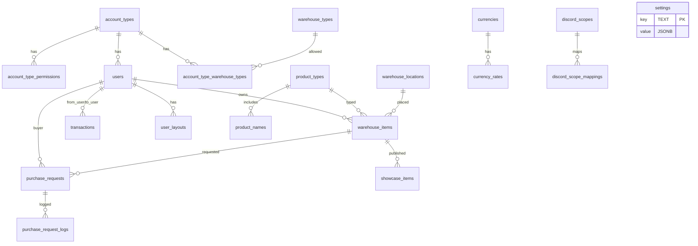

# Star Finance — Схема БД

Источник: миграции в `backend/migrations`. Ниже — перечень таблиц и ключевых колонок.

## Таблицы и колонки

- account_types
  - name TEXT PK

- account_type_permissions
  - account_type TEXT FK -> account_types(name)
  - resource TEXT
  - level TEXT CHECK IN ('none','read','write')
  - PRIMARY KEY (account_type, resource)

- users
  - id TEXT PK
  - username TEXT UNIQUE NOT NULL
  - email TEXT
  - auth_type TEXT NOT NULL DEFAULT 'local'
  - password_hash TEXT
  - account_type TEXT FK -> account_types(name)
  - is_active BOOLEAN NOT NULL DEFAULT TRUE
  - discord_id TEXT
  - discord_data JSONB
  - theme_preference VARCHAR(10) DEFAULT 'light'
  - created_at TIMESTAMPTZ DEFAULT now()
  - last_login TIMESTAMPTZ

- settings
  - key TEXT PK
  - value JSONB NOT NULL

- discord_settings
  - id SMALLINT PK DEFAULT 1
  - enable BOOLEAN NOT NULL DEFAULT FALSE
  - client_id TEXT
  - client_secret TEXT
  - redirect_uri TEXT
  - default_account_type TEXT (в ранних миграциях)

- discord_attr_mappings (устаревающая конструкция, оставлена для совместимости)
  - id SERIAL PK
  - rule JSONB NOT NULL (или поля source/key/value в ранних миграциях)

- discord_guild_mappings (удаляется в 002_drop_guild_mappings.sql)
  - id SERIAL PK (или guild_id TEXT PK в ранних миграциях)
  - rule JSONB NOT NULL

- product_types
  - name TEXT PK

- product_names (в 000_all.sql)
  - name TEXT PK
  - type TEXT FK -> product_types(name)

- showcase_statuses
  - name TEXT PK

- warehouse_locations
  - name TEXT PK

- currencies
  - code TEXT PK

- currency_rates
  - base_code TEXT FK -> currencies(code)
  - code TEXT FK -> currencies(code)
  - rate NUMERIC(18,6) CHECK (rate > 0)
  - PRIMARY KEY (base_code, code)

- warehouse_types
  - name TEXT PK

- warehouse_items
  - id TEXT PK
  - name TEXT NOT NULL
  - type TEXT FK -> product_types(name)
  - quantity NUMERIC(18,3) NOT NULL DEFAULT 0
  - reserved NUMERIC(18,3) NOT NULL DEFAULT 0
  - cost NUMERIC(18,2)
  - currency TEXT
  - location TEXT FK -> warehouse_locations(name)
  - warehouse_type TEXT FK -> warehouse_types(name)
  - owner_login TEXT FK -> users(username)
  - display_currencies TEXT[]
  - meta JSONB
  - created_at TIMESTAMPTZ DEFAULT now()
  - updated_at TIMESTAMPTZ

- showcase_items
  - id TEXT PK
  - warehouse_item_id TEXT FK -> warehouse_items(id) ON DELETE SET NULL
  - status TEXT FK -> showcase_statuses(name)
  - price NUMERIC(18,2)
  - currency TEXT
  - meta JSONB
  - created_at TIMESTAMPTZ DEFAULT now()
  - updated_at TIMESTAMPTZ

- transactions
  - id TEXT PK
  - type TEXT NOT NULL
  - amount NUMERIC(18,2) NOT NULL
  - currency TEXT NOT NULL
  - from_user TEXT FK -> users(id)
  - to_user TEXT FK -> users(id)
  - item_id TEXT (link c сущностью, напр., warehouse_items/showcase_items)
  - meta JSONB
  - created_at TIMESTAMPTZ DEFAULT now()

- purchase_requests
  - id TEXT PK
  - warehouse_item_id TEXT FK -> warehouse_items(id) ON DELETE CASCADE
  - buyer_user_id TEXT FK -> users(id) ON DELETE CASCADE
  - quantity NUMERIC(18,3) CHECK (quantity > 0)
  - price_per_unit NUMERIC(18,2)
  - currency TEXT
  - status TEXT CHECK IN ('В обработке','Заявка отправлена','Выполнено','Отменена')
  - created_at TIMESTAMPTZ DEFAULT now()
  - updated_at TIMESTAMPTZ
  - Индексы: buyer_user_id, status, warehouse_item_id

- purchase_request_logs
  - id BIGSERIAL PK
  - request_id TEXT FK -> purchase_requests(id) ON DELETE CASCADE
  - action TEXT NOT NULL (created|confirmed|canceled|deleted)
  - actor_user_id TEXT FK -> users(id) ON DELETE SET NULL
  - details JSONB
  - created_at TIMESTAMPTZ DEFAULT now()

- user_layouts
  - user_id TEXT FK -> users(id) ON DELETE CASCADE
  - page TEXT NOT NULL
  - layouts JSONB NOT NULL
  - updated_at TIMESTAMPTZ DEFAULT now()
  - PRIMARY KEY (user_id, page)
  - INDEX idx_user_layouts_user (user_id)

- discord_scopes
  - name TEXT PK

- discord_scope_mappings
  - scope TEXT FK -> discord_scopes(name) ON DELETE CASCADE
  - value TEXT
  - account_type TEXT FK -> account_types(name) ON DELETE SET NULL
  - PRIMARY KEY (scope, value)

- account_type_warehouse_types
  - account_type TEXT FK -> account_types(name) ON DELETE CASCADE
  - warehouse_type TEXT FK -> warehouse_types(name) ON DELETE CASCADE
  - PRIMARY KEY (account_type, warehouse_type)

## ERD (Mermaid)

## Замечания
- Некоторые таблицы `discord_*` присутствуют в ранних миграциях и могут быть удалены/заменены позднее (см. `002_drop_guild_mappings.sql`).
- Точные ограничения смотрите в соответствующих файлах миграций.
